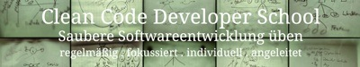

# F# Day by Day
This repository is dedicated to learning the language F# in tiny increments. The idea is you come back to the repo every day for a small dose of Functional Programming (FP).

What F# is, is best said by its current "owner", the F# Foundation at [fsharp.org](http://fsharp.org):

> F# is a mature, open source, cross-platform, functional-first programming language. It empowers users and organizations to tackle complex computing problems with simple, maintainable and robust code.

Whereas "functional-first" means, F# is not purely functional, but also imperative and object-oriented. It's a hybrid or multi-paradigm language. It favors pragmatism over fundamentalism - and strives to make the transition for mono-paradigm language developers into the FP-world easier.

If this does not provide enough motivation for you to learn F#, get some inspiration from the "[Why use F#?](http://fsharpforfunandprofit.com/series/why-use-fsharp.html)" series of articles by Scott Wlaschin.

F# currently is available for the .NET/Mono platform, which means it can not only be used on Windows, but also on Linux and Mac OS. It was originally developed by Microsoft's [Don Syme](http://en.wikipedia.org/wiki/Don_Syme), but since then has been made open source.

There are many resources on F# available for the curious. [fsharp.org](http://fsharp.org) has compiled many fine books and articles and provides guidance for setting up F# on your computer.

Even F# coding environments exist online. Check out

* [tryfsharp.org](http://www.tryfsharp.org/Create), or
* [tryfs.net](http://tryfs.net)

If you don't yet want to clutter your hard disk/desktop with another IDE you can follow along the daily F# snippets with one of the above lightweight REPL environments.

And now... enter into the realm of F# on [day #1](week01/day01).

***

This introductory training for F# is brought to you by the [Clean Code Developer School](http://ccd-school.de), Germany. We also founded the German [Clean Code Developer](http://clean-code-developer.de) community with [currently 4000+ members](http://xing.com/net/ccd) in 2009 and have been teaching principles and practices for clean coding and fluent software production since then to many hundred developers.

