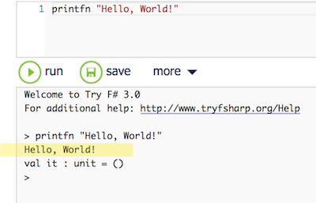
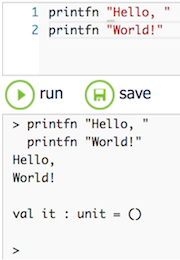
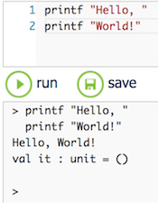
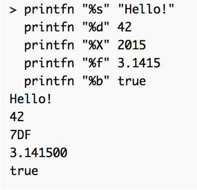

# Day #1
Let's start our F# journey with the obligatory "Hello, World!" program ;-) Here's how it looks in the online F# editor at [tryfsharp.org](http://www.tryfsharp.org/Create):



_printfn_ (print formatted) is the function you call to write data to standard output as text. It prints the data and advances the cursor to the next line:



If you use _printf_ (without the "n") then there will be no line break between successive outputs:



(Function calls in F# always return a value. But what kind of result should _printf_ produce? It's purpose is to produce a side effect on standard output. Nevertheless it produces a result of type _unit_. That's what the last line of the output is about. We'll get to that on a later day. For now ignore it.)

## Simple function calls
This was easy - as it was supposed to be. Still there is something to learn here: How to call a function in the Functional Programming language of F#.

Just write the name of the function - _printfn_ in this example - followed by any parameters. No parentheses, no delimiters except spaces are required. (However, _printfn ("Hello, World!")_ would work just fine.)

Let's try this with 2 parameters:

```
printfn "Hello, %s!" "Peter"
```

Since the format string contains a placeholder ("%s") the function expects another parameter to insert into the output which becomes _Hello, Peter!_.

Common placeholders are:

* %s for strings
* %d for signed integers
* %X for upper case hexadecimal output of integers
* %f for floating point numbers
* %b for boolean values, prints _true_ or _false_
* %A for non-primitive typed data, e.g. lists



Read more about placeholders and output formatting in the [printf documentation](https://msdn.microsoft.com/en-us/library/ee370560.aspx).

Finally a function call with even more parameters:

```
printfn "%s, %d, %f, %b" "Hello!" 42 3.1415 true
```

## Literals
The second thing to learn from _printfn_ is: literals. There are certain rules for how to format literal values in F# code. They are simple, but they exist nonetheless.

Above you've already seen a couple of literals. Each is associated with a data type, e.g.

* _"Hello!"_ is a _string_
* _42_ is an _int_
* _3.1415_ is a _float_
* _true_ is a bool

But there are more primitive types with formatting rules for their literal values, e.g. _char_, _byte_, or _BigInteger_.

### Strings
Strings are sequences of characters. If there is just one character then use ' (single quote) to close it, e.g. 'a'. If there are more than one then use " (double quote), e.g. "abc".

Special characters are represented by prefixing an ordinary character with a \, e.g. '\t' (TAB) or "Hello, \nWorld!" (line break).

If you want to use the backslash in your string prepend a @, e.g. @"c:\windows".

By default strings and characters are encoded as Unicode. If you like them to be ASCII append a B at the end, e.g. 'a'B or 'abc'B. This leads to them being stored as _byte_ and _byte[]_ (_byte_ array).

```
printfn "%A, %A, %A, %A" 'a' 'a'B "abc" "abc"B
```

prints

```
'a', 97uy, "abc", [|97uy; 98uy; 99uy|]
```

### Numbers
Without any other hint numbers are stored as _int_ and _float_, e.g. 123, 3.1415. But you can change that with a suffix:

* y: store as _sbyte_, e.g. 65y
* uy: store as _byte_, e.g. 255uy
* us / s: store as _uint16_, _int16_, e.g. 86us, 86s
* I: store as _bigint_, a representation not limited to 64 bits, e.g. 123456789987654321999999999I

Also you can enter integer values in different numerical systems by prefixing them with 0 and a letter, e.g.

* b: binary, 0b10101
* x: hexadecimal, 0xFE

### Boolean values
The boolean values true and false are written as _true_ and _false_.

Read more about literals [here](https://msdn.microsoft.com/en-us/library/vstudio/dd233193%28v=vs.100%29.aspx).

***

So much for your first day of F#. Now you can write small programms sending greetings of all sorts to the world ;-)