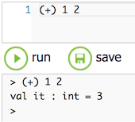
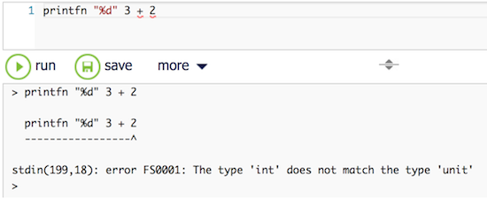

# Day #2 - Operators are functions
Yesterday you learned how to call a simple function to write data to standard output. So far the data were constant values given as literals of different primitive data types.

Today is going to change that. Enter the world of data transformation using operators.

Operators in F# are just functions. You want to add two numbers? Use the `+` operator like this:



It's the same like with `printf`: a function name followed by parameters - just like that.

However, F# needs an operator function name to be enclosed in parentheses. That's because it consists of special characters, not letters.

Or to be more precise: F# needs the parentheses if you put the operator function name first like above. This works with other operators too:

```fsharp
(-) 3 2
(*) 3 2
(/) 3 2 // = 1
(/) 3.0 2.0 // = 1.5
(%) 7 2 // modulo
(=) 7 2 // equal
(<>) 7 2 // not equal
```

You see, F# sports all sorts of common operators in usual form. But note a couple of things:

First, both parameters to binary operators must be of the same type. See `/` above. If you tried

```fsharp
(/) 3.0 2 // does not compile
```

it wouldn't work.

Second, F# uses `=` for equality comparison, not `==` as C#.

There are of course many more operators. See [here](https://msdn.microsoft.com/en-us/library/dd233228.aspx) for a full list. Among them for example the power operator `**`.

It cannot be used like the other ones in parentheses, because `(*` and `*)` enclose multi-line comments. Single line comments start with `//` as you've seen above.

But help is on its way. Or did you believe F# required you to use operators in such a cumbersome way? ;-) Of course it's possible to use binary operators as usual with infix notation:

```fsharp
3 + 2
3 - 2
3 / 2
3.0 / 2.0
7 % 2
7 = 2
7 <> 2

3.0 ** 2.0 // to the power of
```

Also as usual F# assigns operators a precedence:

```fsharp
1.0 + 2.0 * 3.0 ** 4.0 = 163.0
```

So far you've primarily seen numeric operators and some boolean operators. Operators exist for other values, too, though. Use `+` to concatenate strings, for example:

```fsharp
"Hello, " + "World!"
```

Later you'll learn about more operators for other types. Some are binary, some ternary, some unary like

```fsharp
-2
not false
```

Even though operators have their precendences, sometimes there is need for parentheses. Use them as usual in mathematical or logical expressions, e.g.

```fsharp
(1.0 + 2.0) * 3.0

1 <> 1 && (2 = 2 || 3 <> 4)

```

To finish your day's portion of F# here's how to print the results of expressions:

```fsharp
printfn "%d" ((+) 3 2)
printfn "%f" (3.0 ** 2.0)
```

Regardless whether you apply operators in prefix or infix form you need to enclose the function calls in parentheses for output to the console. That way the compiler can tell `(3.0 ** 2.0)` to produce the value for the second parameter to `printfn`.

The reason: Function calls are left associative. To F# `printfn "%d" 3 + 2` looks like `4 + 3 + 2` where `4 + 3` is evaluated first leading to `7 + 2` being evaluated second. But `printfn "%d" 3` results in `unit` leading to `unit + 2` which does not make sense. That's what the following error message means:



To avoid this, put expression parameters in parentheses so the expressions get evaluated first like in `4 * (3 + 2)`.

***

That's it for your second day of F#. Let F# do the math for you from now on ;-)
