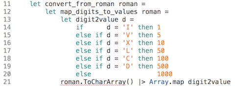

# Day #10 - Operator definition and type constraints
The next feature of the "Convert roman" kata is to actually do a conversion: convert from a roman number to an arabic one, e.g. XLII to 42.

The signature for that function is simple:

```fsharp
let convert_from_roman roman = // ...
```

But how to do this? Do you already know enough of F# to implement a solution?

Time for some thinking...

## Solution design
Before you can write any code you not only need to understand the problem, but also have an idea of how you solution should look like. You can call that a plan or design.

A design is a solution on paper so to speak. And your F# code then is the solution with all its details. The design is more abstract, more coarse grained.

Finding the solution design is the most creative part of programming. Translating it into code is comparatively straightforward most of the time.

So how does converting a roman number into an arabic one work? What are the necessary steps in this transformation process?

* Roman numbers (e.g. 'VI') consist of roman digits each represented by a single character (e.g. 'V') and corresponding to a decimal value (e.g. 5). It seems obvious that a roman number first should be split into its digits which then are mapped to their values.
* The values making up a roman number then can be summed up to calculate the arabic number result.
* Except for those pesky smaller values in front of larger ones, e.g. 'IV' or 'XC'. They have to be negated first to get them subtracted instead of added.

These are distinct aspects or features of the solution. They should be encoded in their own functions with [focused responsibilities](http://geekswithblogs.net/theArchitectsNapkin/archive/2015/04/25/the-single-responsibility-principle-under-the-microscope.aspx). Let the SRP rule! :-)

The outline of the solution then would look like this:

```fsharp
let map_digits_to_values roman = 
  // "XIV" => [10; 1; 5]
  
let negate_smaller_values values =
  // [10; 1; 5] => [10; -1; 5]

let values = map_digits_to_values roman
let negvalues = negate_smaller_values values
List.sum negvalues

```

## Pipe operator
This looks straightforward to implement. But F# can do better than this.

The lines integrating the feature functions into a whole are pretty noisy. You could even say they violate the DRY principle: They repeat on the left side of the binding part of the right side, e.g.

```fsharp
let negvalues = negate_smaller_values values
```

It's negated values than get created by a function that negates values. The meaning of what's happening is not focused on either side. That way the binding could become inconsistent by changing only a part of it, e.g.

```fsharp
let positiveValues = negate_smaller_values values
```

Or it could lure you into using much shorter identifiers, e.g.

```fsharp
let nv = negate_smaller_values values
```

The root cause, though, would not be removed: the need to denote the result of a meaningful operation at all.

Enter the pipe operator. With |> you reverse the order of function call and parameter. The following two function calls are equivalent:

```fsharp
let add x y = x + y

add 2 3
3 |> add 2
```

|> takes a function call on its right side and passes the value on its left side to it as the last parameter.

The pipe operator is called like this because with it it's easy to describe processing pipelines:

```fsharp
let even_only n = n % 2 = 0
let square x = x * x

[1; 2; 3; 4; 5] |> List.filter even_only 
                |> List.map square
                |> List.iter (printfn "%d")
```

(Now you know the reason why the _List_ functions all take the list as their last parameter.)

This can be put to good use in our solution:

```fsharp
roman |> map_digits_to_values
      |> negate_smaller_values
      |> List.sum
```

Isn't that easier to read? And it's DRY.

## Operator overloading
The pipe operator might look like special F# magic, but in fact it's just a predefined convenience function. If it wouldn't exist you could implement it yourself. F# allows you to define and overload operators.

Your own definition of the pipe operator would look like this:

```fsharp
let (|>) x f = f x
```

It's that simple.

Operators are functions like any other - but their identifiers may only consist of the following special characters: !$%&*+-./<=>?@^|~

And because these functions are operators you can use them infix like you're used to from + or /.

```fsharp
1 |> (+) 2 // infix
(|>) 1 ((+) 2) // prefix
```

Operators you define are by default binary or infix, i.e. they take two arguments. But if you use ! or ? or ~ as the first character of an operator identifier, then F# expects the function to only have one parameter and it's treated as a unary operator. As an example here an unary operator to reverse a list:

```fsharp
let (!<) l = List.rev l

!< [1; 2; 3]
```

But you're not limited to defining new operators. If you like, make your life easier by overloading existing operators to work with other type. If you think + is more intuitive than @ to concat lists, then go ahead:

```fsharp
let (+) a b = a @ b

[1; 2] + [3; 4]
```

Just remember: The types of both parameters of infix operators need to be the same!

## Type constraints
As useful the pipe operator is and as interesting operatove overloading looks, it's not required for the solution. You could do without - your code would just be harder to read.

So let's zoom into one of the features and figure out how to implement it:

```fsharp
let map_digits_to_values roman = // ...
```

There are two sub-features to it:

* converting the roman number string into a character array, and
* mapping each character aka roman digit to its value

This seems easy with the help of a CLR function:



But as you can see, this won't compile. The red squiggly line tells us there's something wrong with calling _ToCharArray()_. This is the compiler error message:

> _convertroman/Program.fs(13,13): Error FS0072: Lookup on object of indeterminate type based on information prior to this program point. A type annotation may be needed prior to this program point to constrain the type of the object. This may allow the lookup to be resolved. (FS0072) (convertroman)_

It refers to line 13 where _digit2value_ is defined and complains about not being able to determine the type the function. The return type is obvious, but what's the type of the parameter? It is used like a character inside the function - but the compiler also looks at how the function is called.

It's called by _Array.map_ on array elements - but what is their type? Which leads to the squiggly red line. The compiler does not know what the input array to _map_ is, because it's not sure if _ToCharArray()_ can be applied to _roman_.

Somehow the compiler is not sure whether _roman_ really is a _string_. That's because in its chain of type inference nowhere it's been made crystal clear (for the compiler's taste at least) that this unambiguously is the case.

Maybe you have noticed: So far no explicit type information was given in any code of this tutorial. Values always had a type. But that was inferred automatically by the F# compiler.

F# is a strongly typed language. However that does not mean you have to specify each and every type explicitly. If a type if obvious from a literal's definition, then F# is content with it. From that it can infer the types of values resulting from transformations.

At least mostly. Because as you see, sometimes the type inference engine is confused and needs a little hint.

You can give that with a type annotation or type constraint:

```fsharp
let map_digits_to_values (roman:string) = // ...
```

Just put the type behind the parameter and enclose both in parentheses. The compiler now knows that _roman_ is a string and happily applies _ToChar_Array()_ to it.

This also works for the identifiers in let bindings if need be:

```fsharp
let (a:int) = 42
let (f:int->int) = fun x -> x
```

So watch out for the ominous error message _Lookup on object of indeterminate type based..._ If you encouter it, you'll need to apply a type annotation. It's best, then, to keep the scope of the annotation as narrow as possible. Let type inference do the rest. To not use type constraints makes for less coupling and less typing.

## Solving the negation problem
The function remaining to be refined is

```fsharp
let negate_smaller_values values = // ...
```

How should that be done? The input is a list of values, e.g. [10; 50; 1; 1], of which some elements should be changed. Only if a value is smaller than the next if should be negated, e.g [-10; 50; 1; 1].

Given the index of an element it thus needs to be compared to the element at (index+1).

This can be done with lists, but it seems more natural to use an array for that purpose. Arrays are made for random access, lists not. And array element values can be changed.

```fsharp
let negate_smaller_values values =
    let nvalues = Array.copy values
    List.iter (fun i -> nvalues.[i] <- nvalues.[i] * (if nvalues.[i] < nvalues.[i+1] then -1 else 1)) 
              [0..nvalues.Length-2]
    nvalues
```

That's why this solution sticks to arrays all the way through. Even though lists where used in the solution design it seems more straightforward to use arrays. At least based on the F# features introduced so far.

Note, that _List.iter_ does not refer to the digit values but to a range of indexes given as a list.

And the function stays true to the maxime of immutability. It does not change the input array but copies it before applying negation.

As usual you can find the complete source code in the [repo](src/convertroman/Program.fs).

***

Only one feature to go. That's tomorrow's topic. And you'll learn more about defining your own data types in F#.