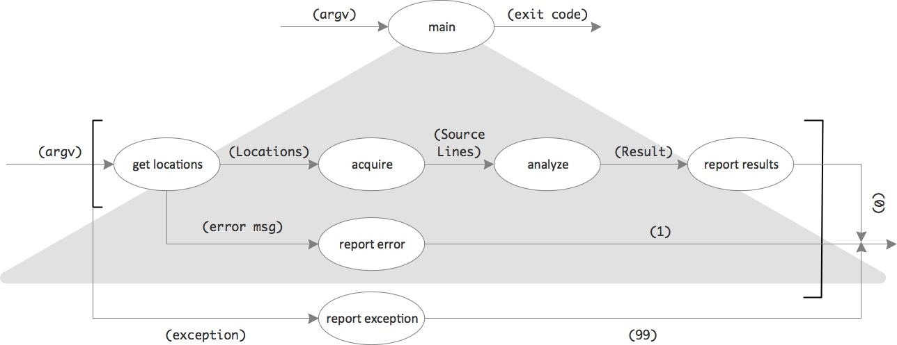
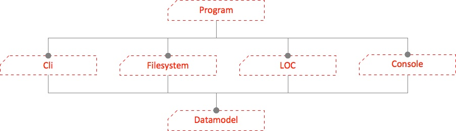
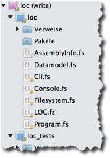

[← Day #14 – Exceptions](../day14) | [Day #16 – Unit testing and function composition →](../../week04/day16)

# Day #15 - Modules and namespaces
After two days of "just theory" it's time again for some practice. Here's a new challenge for you: the [application kata "LOC Counter"](https://app.box.com/s/zwwwlyex8bvf0wq1pn9tmbzryhrla51i).

## Problem analysis
There are two main aspects to the problem:

* **Acquire** source text lines from files and folders. Folders need to be searched recursively for relevant files. Only files with extension `.cs` are relevant. The .NET BCL provides functions which make this very easy.
* **Analyze** the source text lines, i.e. count the non-comment and non-whitespace lines. This is the heart of the program, its domain. Handling multi-line comments will probably require some form of "state machine" to track if a line is inside or outside a multi-line comment.

The source file locations (filenames and foldernames) can be **read from the command line**.

And the results are **written to the console**.

What about errors? If the **program gets started without locations** the user should be informed about the correct usage. This does not seem to be an exceptional situation.

If files are given which are not relevant or are not existing then they will be skipped silently. The specification does not demand otherwise.

Any other error situation signaled by an exception will lead to program termination. The **exception should be displayed**.

## Solution design I
The aspects found during analysis make good candidates for functional units in a data flow (Figure 1).



Each "bubble" is an I/O processor; it transforms input into output. As long as it's a bubble, it's a conceptual thing and part of the solution. It's not yet code. So calling it a function would be misleading.

Functions are implementation details. During solution design you want to stay nimble and not let yourself get bogged down by too much thinking about the implementation and all its details.

Solution design tries to solve the problem on an abstract level, in your head. And drawing a diagram like the above just makes more explicit what's going on in your head ;-) It's a picture for a mental model.

The mental model of software solutions should not be some form of imperative, algorithmic description of what needs to be done. Then there would be hardly a difference between it and code. You'd be slow to come up with it, and it would be hard to keep it all in your head.

Rather it should be a declarative description of a process transforming some input into some output. That's what figure 1 shows: A five step process to transform command line parameters (`argv`) into output an exit code - while causing a side effect on the console (`report ...`).

Drawing such a data flow diagram first instead of sitting down at the IDE right away and start coding has many benefits:

* It's much faster than coding.
* It's much easier to change than code.
* It's easier to communicate to others for review.
* It's a picture and thus tells more than a thousand words ;-).
* It's guiding your coding later on.

The data flow might be the first or even the most important part of a solution design. What is software about if not _processing_ data? So you need to be clear about _what_ to do first, the activities, the processing steps necessary.

But then there is data, too. It's processing _data_. So you need a data model. That's already hinted at in the _data_ flow diagram. Look at the arrows and their data labels between the bubbles.

`Locations`, `Source Lines`, and `Result` describe data that's passed between the processing steps. With F# it's easy to encode such data as types, as you'll see.

And finally there are higher level modules. With more than a couple of bubbles "floating around" understanding will decrease. Hence you gather related bubbles unter "headlines", you combine them to form larger wholes, groups, categories. F# calls them modules. That's what you see in the next picture:


The bubbles are "class-ified" now. Sometimes only one bubble makes up a module, but sometimes there are more.

Those groups also now form a dependency hierarchy:



`Program` is the integration point: it knows all the other modules and weaves them into a data flow. And the other modules all depend on some part of the data model. If `Locations` flow from `get_locations` of the `Cli` module to `acquire` of the `Filesystem` module, then both share this type; it's their data contract.

## Implementation I
Implementing the design is straightforward with F#.

* Bubbles become functions
* For flowing data types will be declared
* Groups of bubbles become F# modules

Here's the translation of the data model and the main data flow:

```fsharp
type Locations = string list
type SourceLines = int * string list
type Result = {numberOfFiles:int; totalLinesOfCode:int}


[<EntryPoint>]
let main argv =      
    try
        argv |> Cli.get_locations 
             |> function
                | Some locations ->
                          locations |> Filesystem.acquire_source_lines
                                    |> LOC.analyze_source_lines
                                    |> Console.report_result
                          0
                | None -> Console.report_error "Usage: loc fileOrFolder {fileOrFolder}"
                          1
    with
    | x -> Console.report_exception x; 99
```

### Data flow
As you can see, a sequence of bubbles is translated using the pipe operator. That's one of the benefits of F# over C#. It keeps the code very readable. Think of how this would look in C#. Either you'd have to introduce temporary variables:

```csharp
var sourceLines = Filesystem.acquire_source_lines(locations);
var result = LOC.analyze_source_lines(sourceLines);
Console.report_result(result);
```

Or you'd have to use nested calls:

```csharp
Console.report_result(
  LOC.analyze_source_lines(
    Filesystem.acquire_source_lines(locations)
  )
);
```

Both variants are less readable than the F# code:

* Temporary variables add noise to the code. They lengthen the lines, make it harder to see what's happening (function call), and possibly violate the DRY principle.
* Nested calls require you to read from inside out and right to left. That's the opposite of your usual reading direction. It adds mental strain.

Compare this to F#:

```fsharp
locations |> Filesystem.acquire_source_lines
          |> LOC.analyze_source_lines
          |> Console.report_result
```

So clear, so easy to read left to right, top to bottom. Relaxing :-)

But this only works for bubbles with one input and one output.

`get locations` has two outputs, though. But fortunately they are either-or, one carries sunny day data, the other signifies the rainy day (when no locations have been passed to the program on the command line). That's an application for the F# Option type:

```fsharp
argv |> Cli.get_locations 
     |> function
        | Some locations -> ...
        | None -> ...
```

Note how this is kept very readable by using `function` instead of `match...with`. With `function` the flow just continues after `argv |> Cli.get_locations`. It bifurcates into either `Some locations` or `None`.

`match...with` would have added an explicit control structure and thus changed the level of abstraction. Not good for understanding.

```fsharp
match (argv |> Cli.get_locations) with
| Some locations -> ...
| None -> ...
```

And to avoid the nested expression to calculate the value to be compared, another function would be needed:

```fsharp
let get_locations = argv |> Cli.get_locations

match get_locations with
  Some locations -> ...
| None -> ...
```

This is a bit easier to read - but would require a lookup of what `get_locations` means. Distracting.

Notice the angle brackets in the data flow diagram? They denote a part of the flow to be checked for exceptions. That's almost like an orthogonal flow.

Their bifurcation is readily translated into `try...with`:

```fsharp
try
	...
with
| x -> Console.report_exception x; 99
```

The happy day flow is what happens in `try`. The rainy day flow is what happens in `with`.

Note the use of a semicolon before the exit code 99. It's for putting multiple expressions in one line. Use it sparingly! It makes lines longer and thus harder to read. It blurs where one expression ends and the next starts. Better put expressions onto their own text lines.

In this case however it seemed ok to use `;`. The exit code is of not much importance and can trail the main action to take.

### Data model
The data model uses an alias, a tuple, and a record. To show off as many features of F# as possible ;-)

`Locations` read from the command line - names of files and folders - are just a list of strings. To give this a name makes the code a bit more readable and ensures the domain concept is encoded somehow.

The `Result` is where data flows from the inside to the outside, that's why it seems prudent to encode it as a record. That way there is no doubt for any "outsider" what a result is. Right now there is no real outsider; the result just gets printed to the console. But this might change at any time. The environment of the domain is fleeting.

`SourceLines` on the other hand are just a temporary data structure. It's exchanged between two processing steps on the inside. That's why only a tuple is used for it at the moment. Consumer and producer are pretty close.

## Modularization
Modules are compile time containers for code to increase evolvability. Putting together "stuff" that belongs together (high cohesion) and partly hiding it (information hiding) helps understandability and decoupling.

Functions are the smallest kinds of modules. They encapsulate expressions behind a name and a contract. A functions signature gives meaning to the encompassed expressions.

The next larger kind of modules in C# are classes. In F# it's modules. Modules contain let bindings, type definitions, and nested modules.

As long as your programs consist only of a single source file the F# compiler automatically wraps the code therein into a like named module.

But as soon as you start putting your code into several files, you need to define modules explicitly. Only the last file in the compilation order may lack a module definition.

To place all the code in a file in a module, open the module at the top of the file and do not indent the code in the file:

```fsharp
module Cli

let get_locations (argv:string array) : Option<Datamodel.Locations> =
    match argv with
    | [||] -> None
    | locations -> locations |> Array.toList |> Some
```

To use the function value in another module it has to be prefixed by the module name, e.g. `Cli.get_locations`. To spare yourself from repeatedly using module names as prefixes, you can open them once at the beginning of the client module, e.g.

```fsharp
module Cli

open Datamodel

let get_locations (argv:string array) : Option<Locations> =
	...
```

By default definitions in a module are public. But you can make them private or internal.

```fsharp
let private a = ...
let internal b = ...
```

Such differentiation makes a `module` a module. It allows you to hide details and publish only a selected number of names as an API.

Figure 4 shows how each module defined during solution design gets its own source file.



The order of files is bottom up regarding the dependencies depicted in Figure 3. _F# requires you to define names before you use them._ That's easy to do within a source file. But across files you have to take special care. After creation source files usually are listed in alphabetical order. You need to rearrange them using drag&drop to get them in the right order for compilation.

If you want to define more than one module within a single source file you can do so, too. But then you need to follow its name with a `=` and indent the definitions inside it.

Here's how two of the modules of the solution could be combined into a single source file:

```fsharp
// ui_adapters.fs
module Cli =
	let get_locations (argv:string array) : Option<Datamodel.Locations> =
    	match argv with
    	| [||] -> None
    	| locations -> locations |> Array.toList |> Some
    	
module Console =
	let report_result (result:Datamodel.Result) =
    	printfn "%d source files found with %d lines of code"
    	        result.numberOfFiles result.totalLinesOfCode
   ...
```

## Namespaces
Namespaces look like modules, but they are not modules. Namespaces are just syntactic sugar. This is no different from C#.

In F# namespaces can container types and modules. Let bindings are only allowed in modules.

If you need explicit namespaces in addition to modules then you usually put them at the beginning of source files, e.g.

```fsharp
// cli.fs
namespace Adapters

module Cli =
	open Datamodel
	
	let get_locations (argv:string array) : Option<Datamodel.Locations> =
		...
		
// console.fs
namespace Adapters

module Console = 
    let report_result (result:Datamodel.Result) =
		...
```

As you can see, several files can contribute to a namespace. That's not possible for modules.

Namespaces are no modules because they do not allow for encapsulation. There is no visibility concept associated with namespaces. Their purpose is to organize names, not hide information.

***

Modularization is an important aspect of software development. Now you know how it's done with F#. Functional Programming does not mean "no modules". You have to think about how to group functions into modules like you have to think about how to group methods into classes in C#.

### Read more
* Microsoft, [Modules (F#)](https://msdn.microsoft.com/en-us/library/dd233221.aspx)
* Scott Wlaschin, [Organizing modules in a project](http://fsharpforfunandprofit.com/posts/recipe-part3/)
* Wikibooks, [F Sharp Programming / Modules and Namespaces](https://en.wikibooks.org/wiki/F_Sharp_Programming/Modules_and_Namespaces)

[← Day #14 – Exceptions](../day14) | [Day #16 – Unit testing and function composition →](../../week04/day16)
