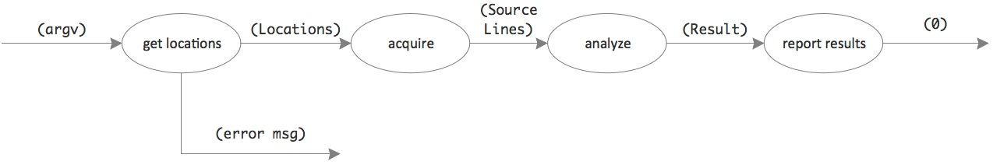
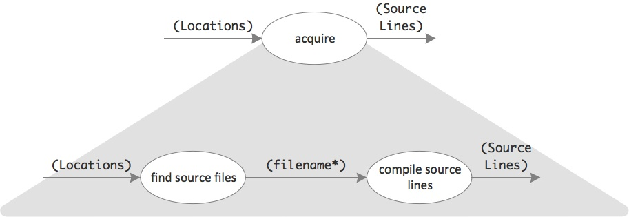
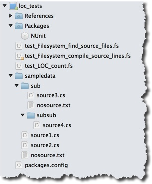

# Day #16 - Unit testing and function composition
Yesterday's challenge has not fully been solved. Only a rough solution has been sketched. Some drill down and more detailed implementation is in order.

## Solution design II
As you might remember, the happy day data flow looks like this:



_get locations_ and _report results_ seem easy enough. They can be straightforwardly implemented.

But what does _acquire_ mean? A list of filenames ans foldernames has to be transformed into a long list of source lines accompanied with the number of relevant files found.

For the analysis it's not important to keep the lines of one source file separat from those of another. That's why it's just one long list.

But surely this task should not be accomplished by just one bubble. There seem to be at least two responsibilities at work: finding all the relevant files and compiling their lines into one long list. This should be visible in the visual design:



By this _acquire_ has turned from an assumed operation into an integration. It doesn't do any hard work itself, but coordinates other bubbles to do it. Like _main_ does.

This part of the solution now is looking simple enough. It's ready for coding...

## Implementation II
This is how the happy day flow was implemented yesterday:

```fsharp
locations |> Filesystem.acquire_source_lines
          |> LOC.analyze_source_lines
          |> Console.report_result
0
```

The new integration function _acquire_source_lines_ is part of the _Filesystem_ module. The same should now be true for its operations:

```fsharp
module Filesystem =
    let internal find_source_files (locations:Datamodel.Locations) : string list =
        ...

    let internal compile_source_lines (filenames:string List) : Datamodel.SourceLines =
        ...

    let acquire_source_lines locations =
        locations |> find_source_files |> compile_source_lines
```

The translation of the integration bubble is simple enough. It becomes a function. Again. Like all the other bubbles.

### Function composition
As it turns out, though, this kind of integration is pretty common: a pipeline of functions fueled by a single input parameter.

That's why F# provides a shortcut for this pattern. With the function composition operator >> you can shrink the function:

```fsharp
let acquire_source_lines =
    find_source_files >> compile_source_lines
```

You can leave out the parameter. The function thus only consists of functions strung together by >>.

Function composition welds together pieces into a new whole. That's why the parameter is not necessary. What needs to flow in is derived from the first function.

### Unit tests
Implementing file aquisition was easy. But what about its processing steps? They don't seem trivial. You probably can't just write their down their logic. Better to develop that in increments. It's time for some test-first development.

Fortunately doing that is easy with F#. As easy as it is with C#. You can use the same tools, for example NUnit.

Here's how it can be done for this kata:



1. Set up a library test project in the VS.NET/Xamarin Studio solution.
2. Add NUnit via Nuget to the test project.
3. Then set up sample data in the test project. Set the properties of the files so they get deployed to the target directory upon compilation. See the _sampledata_ folder in the project in Figure 3. Or go [here](../../day15/src/loc/loc_tests) for the sources.
4. Set up your first test like this:

```fsharp
module test_Filesystem_compile_source_lines

open NUnit.Framework
open Adapters

[<Test>]
let ``load lines of one file``() =
    let n, lines = Filesystem.compile_source_lines ["sampledata/source1.cs"]
    Assert.AreEqual(1, n)
    Assert.AreEqual(7, lines.Length)
```

Putting the tests in a module and opening namespaces is straightforward. What's interesting is how you designate a F# function as a NUnit test case: Just put the _[<Test>]_ attribute on a function let binding. And be sure to add () to the function name to tell the compiler it's a function value without parameters.

That's it. No test class with _[<TestFixture>]_ needed like in C#. Just test functions.

You can use the familiar NUnit _Assert_ methods to check your expectations. Or you might want to add some more F# like unit testing power, e.g. from FSUnit. But to get you started NUnit should be enough. Stay close to home for now :-)

Note how F# lets you give test cases easy to read names: enclose them in two backticks and you can include whitespaces.

With a couple of tests in place the implementation of the source line compilation is easy:

```fsharp
let internal compile_source_lines (filenames:string List) : Datamodel.SourceLines =
    let lines = 
        let to_lines filename =
            System.IO.File.ReadAllLines(filename) |> Array.toList

        filenames |> List.map to_lines |> List.concat

    (filenames.Length, lines)
```

There is only one noteworthy aspect: how the flat list of source lines is produced.

Loading the source lines of several files just takes:

```fsharp
filenames |> List.map to_lines
```

A list of filesnames is mapped to a list of lists of source lines, e.g.

```fsharp
[
	["using System"; ""; "class Program {"; ...];
	["using NUnit.Framework"; ""; "[TestFixture]"; ...];
	...
]
```

But what should be delivered is just a flat list of source lines across all files:

```fsharp
[
	"using System"; ""; "class Program {"; ...
	"using NUnit.Framework"; ""; "[TestFixture]"; ...
	...
]
```

This feat is accomplished by _List.concat_. It takes a list of lists and appends all elements of all lists into a new list.

***

Although developing logic test-first is of less importance with F# and its REPL environment and small functions and strict typing it's a good thing to have a regression test suite for your code. As you see that's as easily done with F# as it is with C#. Or even easier.

### Read more
Function composition

* Scott Wlaschin, [Function associativity and composition](http://fsharpforfunandprofit.com/posts/function-composition/)
* Chris Smith, [Function Composition](http://blogs.msdn.com/b/chrsmith/archive/2008/06/14/function-composition.aspx)

Unit testing

* Scott Wlaschin, [Use F# to unit tests programmatically](http://fsharpforfunandprofit.com/posts/low-risk-ways-to-use-fsharp-at-work-3/#test-runner)
