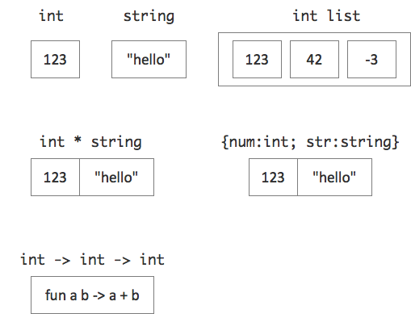

# Day #18 - Discriminated Unions
Yesterday's active patterns are strange, aren't they? But they are cool, too. A powerful feature of F# to encapsulate decision making. But wait, there's more!

Active patterns are based on a special data type. A data type where you specify exactly which values it encompasses.

Think of the data types so far, e.g. scalars, lists, tuples, records, functions. They all define a structure for their values.



The values in the figure are just examples. Essentially there is hardly a limit to which values the structures can contain. The value range is very, very wide. Except for the _bool_ type there are millions or more possible values in each.

But there is one more data type in F# where you percisely define which values it encompasses: *Discriminated Unions*.

In its simplest form a Discriminated union looks like an _enum_ in C#:

```fsharp
type States = Running | Paused | Stopped | Waiting
type DaysOfWeek = Mon | Tue | Wed | Thur | Fri | Sat | Sun
```

This defines two types with four and seven possible values. Names can be bound to those values just like that:

```fsharp
let state = Running
let today = Thur
```

Interpret the | between the values as an 'or': a _state_ can be _Running_ or _Paused_ or ... Just note: Value identifiers need to start with a capital letter.

Usually you don't need to prefix a union type value with the type's name. But if there are several union types defining the same value, then you need to be more specific:

```fsharp
let state = States.Running
```

Interestingly, now, those basic values of a union type can have structure themselves. They can be typed.

```fsharp
type Result = 
      Success of int
    | Failure of string
```

The full value then consists of its name followed by its "payload" matching the type specified in the union type definition:

```fsharp
let r = Success 5
let f = Failure "error!"
```

Of course the "payload type" can differ for each value of the union type. So don't be shy. Use whatever serves the purpose:

```fsharp
type Person = {name:string; age:int}
type Result =
      Success of Person
    | Failure of string list
    
let r = Success {name="Mary"; age=42}
let f = Failure ["error 1"; "error 2"]
```

Or even use another union type as the type of a value.

To access a union type value's payload or to act on such values at all you use pattern matching. Again ;-)

```fsharp
match state with
    Running -> ...
  | Paused -> ...
  | _ -> ...
```

That's also how you get at the payload of a union type value:

```fsharp
match r with
    Success person -> ...
  | Failure errorList -> ... 
```

## Use union types for more type safety
How do you ensure, a value in a program actually has a specific meaning? What does the value 42 or "Wednesday" mean? Maybe 42 is just the result of a math operation, but maybe it's an answer. "Wednesday" may refer to a day of the week or to a person.

Binding the values to meaningful names is good, but in the end does not cut it:

```fsharp
let answer = 42
let name = "Wednesday"

...

let x = name
```

Ones bound to another name the meaning might be lost. It's not inherent in the value.

What's needed is a special data type. You might think of doing this:

```fsharp
type Answer = int

let (answer:Answer) = 42

let x = answer
```

Indeed the type of _x_ is _Answer_. The meaning is carried over. Great!

But, alas!, look at this:

```fsharp
match x with
    1984 -> ...
  | _ -> ...
```

_x_ despite being an _Answer_ (possibly _the_ answer!) can be compared to an ordinary _int_ value. The reason: _Answer_ is just an alias for _int_; any _Answer_ value is still an _int_. That's not what you wanted, isn't it.

Discriminated Unions to the rescue! What you can do is, define a union type with just one value:

```fsharp
type Answer = Answer of int

let answer = Answer 42

let x = answer
```

So far there is not much of a difference. But now try the _match-with_ like above. Doesn't work any more. The compiler refuses to compare an _int_ value to an _Answer_ value.

To make this work you'd need to become specific:

```fsharp
match x with
    Answer 1984 -> ...
  | _ ->
```

Now it's explicitly stated that 1984 is meant to be an answer as well.

So to turn a single scalar value into something very special use a single value union type.

This also works nicely for function parameters. Suppose you want to make sure a function only works in answers:

```fsharp
let f (a:Answer) = ...
```

Now the function cannot be called with just any _int_ value anymore.

Within the function you'd have to deconstruct the answer using _match-with_, though.

But what if you only want to work with the payload? Then write the parameter as a pattern like in _match-with_:

```fsharp
let g (Answer a) = ...
```

The parameter _a_ now is just an _int_. Deconstruction will be done automatically upon function call.

This even works if a union type defines several values, e.g.

```fsharp
type Id =   PersonId of int
          | DocumentId of int
          
let load (PersonId id | DocumentId id) = ...
```

Of course this only works if the payload of all values is of the same type.

## Roll your own ADT
Discriminated Unions also can be used to build Abstract Data Types (ADT), where the structure of the data is opaque to clients. Here's a very simple stack as an example:

```fsharp
module Stack =
    type Stack =  private Element of int * Stack
                        | Floor
                
    let empty = Floor
    
    let push (value:int) (stack:Stack) =
        Element (value, stack)
        
    let pop (stack:Stack) = 
        match stack with
              Element (top, rest) -> (top, rest)
            | Floor -> failwith "Stack is empty!"
          
    let toList (stack:Stack) =
        let rec toList (stack:Stack) l =
            match stack with
                Element (top, rest) -> toList rest (top :: l)
              | Floor -> l
        toList stack [] |> List.rev
```

Note how the union type is used to define the stack's structure. A stack is either the value _Floor_ or it's a value _Element_ with a payload consisting of an _int_ and a _Stack_. A stack thus is viewed as a recursive data structure.

But the visibility modifier _private_ is used to encapsulate this structure. A _Stack_ value can only be (de)composed using the published functions _push_, _pop_, _empty_, and _toList_.

```fsharp
open Stack

let s = Empty |> Push 1 |> Push 2 |> Push 3

let top, _ = Pop s
printfn "%d" top

s |> toList |> printfn "%A"
```

***

You sure recognized how Discriminated Unions are behind Active Patterns. An Active Pattern is just a convenient way to weld together a union type and the logic to create one of its values for the purpose of decision making.

### Read more
Discriminated Unions

* Microsoft, [Discriminated Unions](https://msdn.microsoft.com/en-us/library/dd233226.aspx)
* Dave Fancher, [F# Discriminated Unions](http://davefancher.com/2013/01/15/f-discriminated-unions/)
* Scott Wlaschin, [Discriminated Unions](http://fsharpforfunandprofit.com/posts/discriminated-unions/)
* Stackoverflow, [When to use Discriminates Union vs Record Type in F#](http://stackoverflow.com/questions/17291932/when-to-use-a-discriminate-union-vs-record-type-in-f)
* Wikibooks, [F Sharp Programming / Discriminated Unions](https://en.wikibooks.org/wiki/F_Sharp_Programming/Discriminated_Unions)

