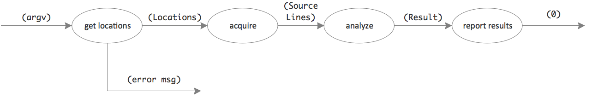
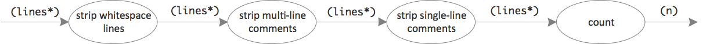
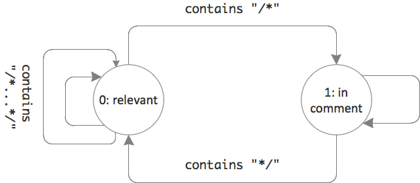

# Day #19 - Mutable data and list comprehension
You remember the excersise from [day #15](https://github.com/ccdschool/fsharpdaybyday/tree/master/week03/day15)? There are still one problem to solve: counting the non-comment and non-whitespace lines.

As a refresher here's the context:



And here's how this could look in code:

```fsharp
argv |> Cli.get_locations 
     |> function
        | Some locations ->
                  locations |> Filesystem.acquire_source_lines
                            |> LOC.analyze_source_lines
                            |> Console.report_result
                  0
        | None -> Console.report_error "Usage: loc fileOrFolder {fileOrFolder}"
```

The functional unit in question is _analyze_; its result looking like this:

```fsharp
type Result = {numberOfFiles:int; totalLinesOfCode:int}
```

and can be created like this:

```fsharp
module LOC =
	...
	
	let analyze_source_lines (n, lines) : Datamodel.Result =
   		{Datamodel.numberOfFiles=n; 
   		 Datamodel.totalLinesOfCode=count lines}
```

which now begs the question: How should `count` work? Its purpose is to return a single number: the number of relevant lines.

## Solution design IV
Relevant lines are those which...

* don't just contain whitespace
* do not belong to a comment, which means they...
  * are not completely part of a multi-line comment
  * are not completely a single line comment
  
Getting to the relevant lines of code thus means stripping off irrelevant ones which can be done in a straightforward process:



The implementation of all functional units should be simple - except for stripping multi-line comments.

Stripping whitespace lines or single-line comments are simple because the decision whether a line is relevant or not can be done by looking at just the line in question. Does it just contain whitespace? Does it start with `//` after just whitespace?

But multi-line comments are different! Whether a line is part of a comment or not does not just depend on the line itself but also on a previous one. Some state has to be taken into account.

This is best described by a small finite state machine:



The state machine is presented with each line and decides which state to switch to. The initial state is 0.

* When in 0 and a line does not contain `\*` just output it.
* When in 0 and a line does contain `\*` to start a multi-line comment, then switch to 1. The line is only output if it does not start with `\*`.
* When in 1 and a line contains `*/` to close a multi-line comment then switch to 0. The line is only output if does not end with `*/`.
* When in 1 and no `*/` is found then gobble up the line, it's an in-comment line.
* When in 0 and within the line a multi-line comment is opened and closed then no state transition occurs. Whether the line is output or not depends on non-whitespace before/after the comment brackets.

Of course this is too simple a state machine for the real world. It does not cover a couple of cases which probably occur in your code bases like nested multi-line comments. But it's sufficient for this introduction's purpose.

## Implementation IV
As the above data flow design suggests the overall filtering process can be implemented using the pipe operator:

```fsharp
lines |> List.filter whitespace
      |> filter_multi_line_comments
      |> List.filter single_line_comments 
      |> List.length
```

And checking for a non-whitespace and non-single-line-comment lines are just one line functions to use as filters on the list of lines:

```fsharp
let whitespace (line:string) =
    line.Trim() <> ""

let single_line_comments (line:string) =
    not (line.Trim().StartsWith("//"))
```

Implementing the state machine, though, poses a problem. A simple `List.filter` does not work since there is no way to carry over state from checking one line to the next. An ordinary loop with some state variable would be handy.

### Mutable state
So finally after 18 days of pur Functional Programming here's the dirty truth: F# actually features variables.

So much for immutable data as the hallmark of Functional Programming.

Immutability is the default, of course. But if push comes to shove you can use mutable data aka variables. Just be careful to not fall back into imperative programming habits; it mutability with caution.

To create a variable instead of just a binding to an immutable value just prefix the name with `mutable` like this:

```fsharp
let mutable sum = 0
```

You then can assign new values to the name any time:

```fsharp
sum <- 1
sum <- sum + 1
```

Just use the `<-` instead of an `=` to make it explicit you know what you're doing: changing data in place.

Of course once assigned a value the type of the variable cannot change anymore. Remember: F# is a type safe language.

That's the story of variables in F#. At least from F# 4.0 on. Because before that you had to look closer...

### Ref values
Before F# 4.0 you had to distinguish between mutable data on the stack and on the heap. The `mutable` keyword signifies a stack based variable. A stack based variable can be used in the same function it's defined in.

If you wanted to use it in another function, though, this did not work. Because that would mean it would have to be captured in a closure. Since F# views functions as values which can be passed around at will closures are created all the time. Just because a function gets defined in some context (while a certain stack exists) does not mean it will get executed in that context.

To allow mutable state in such cases, F# introduce heap based mutable state or _ref values_ with yet another syntax:

```fsharp
let sum = ref 0
sum := 1
sum := !sum + 1
```

`:=` is used as the assignment operator instead of `<-`. But also you need to dereference the variable's value explicitly by putting `!` before it's name when you read it.

Of course this was kind of confusing. You had to think about how you wanted to use a variable and then choose the proper kind.

Fortunately this is over now with F# 4.0. The compiler makes the decision for you. You only need to use the syntax for stack based variables.

With mutability in hand you can now create an ordinary imperative loop to strip multi-line comments from a list of lines. Here is a simplified version of a state machine like above. Comments are opened with `(` and closed with `)`:

```fsharp
let filter_multi_line_comments lines =
    let inComment = ref false
    let relevant = ref []
    for l in lines do
        if !inComment then
            inComment := l <> ")"
        else
            inComment := l = "("
            if not !inComment then relevant := !relevant @ [l]
    relevant
    
["a"; "("; "x"; ")"; "b"] 
    |> filter_multi_line_comments 
    |> printfn "%A"
```

Only lines "a" and "b" are returned as relevant.

Note how ref values are used for both the state variable (`inComment`) and the "bucket" for the relevant lines. A new list is created from the list passed in.

### List comprehensions
Filtering like this works, but leaves room for improvement. Even though the state variable seems inevitable, building the resulting list using another variable seems awkward.

Building lists from constans is easy. Just enumerate them separated by semicolons:

```fsharp
let relevant = ["a"; "b"]
```

But this is only a shortcut. It's a special case. The general case is that of an algorithm producing a stream of values. Each value output using `yield`. This works almost like `return`. It passes on/out a value - but does not terminate the algorithm.

The simples form of using `yield` is like this:

```fsharp
let relevant = [yield "a"; yield "b"]
```

or like this:

```fsharp
let relevant = [
    yield "a"
    yield "b"]
```

Each `yield` appends another value to the list. The value producing algorithm thus is written _inside_ the list brackets. That's called _list comprehension_.

This of course does not only work with a sequence of yields. They can be burried in loops, even nested loops. Here's how this can be used with stripping multi-line comments:

```fsharp
let filter_multi_line_comments lines =
    [
        let inComment = ref false
        for l in lines do
            if !inComment then
                inComment := l <> ")"
            else
                inComment := l = "("
                if not !inComment then yield l
    ]
```

This is easier to read, isn't it? It's clear from the start that the purpose of the function is creation of a list; the list forms the body of the function. And then, within the list, there is an algorithm yielding lines to the list as it sees fit.

For the real code to filter multi-line comments see the [sources of day #15](https://github.com/ccdschool/fsharpdaybyday/blob/master/week03/day15/src/loc/loc/LOC.fs).

***

This finishes the series of daily articles solving the line counting exercise. A simple problem - but with quite some opportunities to apply F# goodness. See [here](https://github.com/ccdschool/fsharpdaybyday/tree/master/week03/day15/src/loc) for the full sources.

### Read more

Mutable data

* Microsoft, [Announcing a preview of F# 4.0 and the Visual F# Tools in VS 2015](http://blogs.msdn.com/b/fsharpteam/archive/2014/11/12/announcing-a-preview-of-f-4-0-and-the-visual-f-tools-in-vs-2015.aspx)
* Wikibooks, [F Sharp Programming - Mutable Data](https://en.wikibooks.org/wiki/F_Sharp_Programming/Mutable_Data)

List comprehensions

* Wikibooks, [F Sharp Programming - Lists](https://en.wikibooks.org/wiki/F_Sharp_Programming/Lists)
